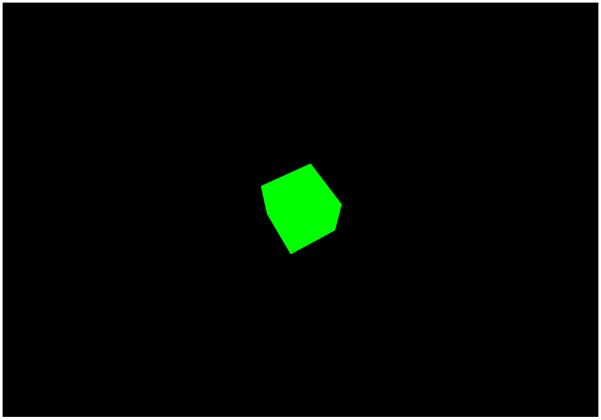
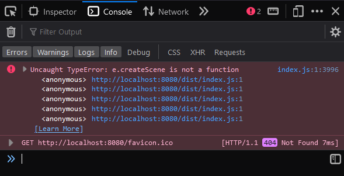

# Webpack + ThreeJS CDN

## ✅ Inside a simple project

```bash
git clone https://github.com/FelipeR2U/external-three.git
cd external-three
yarn
cd library
yarn build:dev && yarn dev
```

- The result should be working in `localhost:8080`

  

## ❌ Using this project as a dependency

```bash
git clone https://github.com/FelipeR2U/external-three.git
cd external-three
yarn
cd library
yarn build
cd ../project
yarn build && yarn dev
```

- The result should not be working in `localhost:8080`

  
